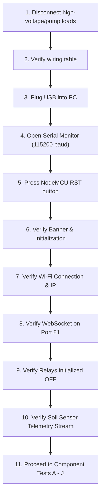

# AgroSense SIH25015 — First Power-On & Testing Guide

> **Target Board:** NodeMCU 1.0 (ESP-12E Module)  
> **Firmware Version:** `AgroSense-ESP-v2.0`  
> **Primary Transport:** WebSocket on Port `81` (`ws://<NODE_IP>:81`)  
> **Serial Interface:** 115200 Baud (8-N-1)

---

## Hardware Configuration & Pin Map

Before powering the board, verify your physical connections against the table below.

| NodeMCU Pin | ESP8266 GPIO | Connected Peripheral | Default State at Boot | Logic Polarity | Notes |
| :--- | :--- | :--- | :--- | :--- | :--- |
| **D1** | `GPIO 5` | Pump Relay `IN` | **HIGH (OFF)** | Active-**LOW** | Relay de-energized |
| **D2** | `GPIO 4` | Solenoid Valve Relay `IN` | **HIGH (OFF)** | Active-**LOW** | Relay de-energized |
| **D4** | `GPIO 2` | Built-in Blue LED | **HIGH (OFF)** | Active-**LOW** | Turns ON when WebSocket client connects |
| **A0** | `ADC 0` | Soil Moisture Sensor (Analog Out) | Analog Input | `0 – 1023` ADC | 10-bit analog input (0V–3.3V range via NodeMCU resistor divider) |
| **3V3 / GND** | 3.3V / 0V | Sensor Power & Ground | Power Rail | 3.3V DC | Do **NOT** connect 5V to ESP8266 GPIOs |
| *Simulated* | *N/A* | Ambient Temperature & Humidity | N/A | Simulated | **SOFTWARE SIMULATED** (No physical DHT sensor required) |

> [!CAUTION]
> ### Electrical Safety Rules
> 1. **DO NOT CONNECT AC MAINS (110V/230V) OR HIGH-CURRENT DC MOTORS TO RELAY CONTACTS DURING INITIAL BENCH TESTING.**
> 2. Keep the relay terminal blocks completely disconnected from pumps and solenoid valves until all logic tests pass.
> 3. External load power supplies: **NOT SPECIFIED — USER MUST VERIFY** load voltage (e.g., 12V DC pump vs 24V DC solenoid) and use an independent, isolated power supply with a flyback diode.
> 4. ESP8266 GPIO pins are **3.3V logic only** and cannot source more than 12 mA per pin. Never connect a relay coil directly to a GPIO pin without an optocoupler/transistor driver board.

---

### Hardware Wiring Schematic (ASCII Diagram)

```text
               +---------------------------------------------------+
               |             NodeMCU 1.0 (ESP-12E)                 |
               |                                                   |
               |  [ A0 ] <==== Analog Signal ==== [ Soil Sensor AO ]
               |  [3V3 ] -----------------------> [ Soil Sensor VCC]
               |  [ GND] <----------------------- [ Soil Sensor GND]
               |                                                   |
               |  [ D1 ] ===== Signal (IN1) ====> [ Relay Module CH1 (Pump)  ]
               |  [ D2 ] ===== Signal (IN2) ====> [ Relay Module CH2 (Valve) ]
               |  [VIN ] -----------------------> [ Relay Module VCC (5V DC) ]
               |  [ GND] <----------------------- [ Relay Module GND         ]
               |                                                   |
               |  [ D4 ] -----> On-board LED (Active-LOW)          |
               |                                                   |
               |  [Micro-USB] <== Data Cable ==> [ PC / USB Hub ]  |
               +---------------------------------------------------+

       +------------------------- ISOLATION BARRIER -------------------------+
       |                                                                     |
       |  [ Relay CH1 COM/NO ] ---> [ DISCONNECTED FOR BENCH TEST ]          |
       |  [ Relay CH2 COM/NO ] ---> [ DISCONNECTED FOR BENCH TEST ]          |
       +---------------------------------------------------------------------+
```

---

## 1. FIRST POWER-UP PROCEDURE (Step by Step)

Follow this 13-step sequence strictly from top to bottom on the initial bench test.



- [ ] **Step 1: Disconnect all output loads**  
  Ensure no 12V/24V pump, solenoid valve, or external battery/power supply is wired into the relay terminal screws (COM/NO/NC). The relays should switch freely with nothing connected to the contacts.

- [ ] **Step 2: Double-check all low-voltage wiring**  
  - NodeMCU `D1` to Relay `IN1` (Pump)
  - NodeMCU `D2` to Relay `IN2` (Valve)
  - NodeMCU `A0` to Soil Sensor `AO` (or signal pin)
  - NodeMCU `3V3` to Soil Sensor `VCC`
  - NodeMCU `GND` to Soil Sensor `GND` and Relay module `GND`
  - NodeMCU `VIN` to Relay module `VCC` (5V USB rail)

- [ ] **Step 3: Connect NodeMCU via USB**  
  Plug a micro-USB data cable (ensure it is a data cable, not a charge-only cable) from the NodeMCU to your computer.

- [ ] **Step 4: Open Arduino IDE Serial Monitor**  
  Open Arduino IDE, select the appropriate COM port (e.g., `COM3`, `COM4`, `/dev/ttyUSB0`), and open the Serial Monitor (**Tools → Serial Monitor** or `Ctrl+Shift+M`).

- [ ] **Step 5: Set Baud Rate to 115200**  
  In the bottom-right corner of the Serial Monitor, select **115200 baud** and **Both NL & CR** (or **Newline**).

- [ ] **Step 6: Press the RST Button**  
  Press the small tactile push-button labeled **RST** on the NodeMCU board to restart the microcontroller cleanly.

- [ ] **Step 7: Confirm Firmware Banner**  
  Look for the AgroSense startup header in the Serial Monitor:
  ```text
  ==========================================================
    AgroSense SIH25015 — ESP8266 NodeMCU 1.0 Gateway
  ==========================================================
  ```

- [ ] **Step 8: Confirm GPIO Initialization**  
  Verify the line: `[INIT] GPIO initialised — all relays OFF, LED OFF`.

- [ ] **Step 9: Confirm Wi-Fi Connection**  
  Watch the connection dots `.....`. Confirm `[WIFI] ✅ Connected successfully!` appears.

- [ ] **Step 10: Record the IP Address & WebSocket URL**  
  Note the assigned IP address (e.g., `192.168.1.150` or `10.18.37.83`) and confirm the WebSocket URL:
  `[WIFI] 🌐 WebSocket URL : ws://192.168.x.x:81`

- [ ] **Step 11: Confirm WebSocket Server Started**  
  Verify the log line: `[WS] 🚀 WebSocket server listening on port 81`.

- [ ] **Step 12: Confirm Telemetry Broadcasts**  
  Every 2 seconds (2000 ms), the Serial Monitor should print a telemetry broadcast line:
  `[TELEMETRY] 📡 Broadcast → {"type":"telemetry","temperature":...,"humidity":...,"soilMoisture":...,"pumpActive":false,"valveOpen":false}`

- [ ] **Step 13: Proceed to Component Tests**  
  Only when Steps 1–12 are confirmed with zero boot errors should you proceed to the component tests in Section 3.

---

## 2. SERIAL MONITOR GUIDE — What You Should See

### Exact Expected Startup Output

```text
==========================================================
  AgroSense SIH25015 — ESP8266 NodeMCU 1.0 Gateway
==========================================================
[INIT] GPIO initialised — all relays OFF, LED OFF
[WIFI] Connecting to SSID: YourNetwork .........
[WIFI] ✅ Connected successfully!
[WIFI] 📍 NodeMCU IP address : 192.168.1.150
[WIFI] 🌐 WebSocket URL      : ws://192.168.1.150:81
[WIFI]    ↑ Copy this URL into React or localStorage
[WS]   🚀 WebSocket server listening on port 81
==========================================================

[TELEMETRY] 📡 Broadcast → {"type":"telemetry","temperature":"28.4","humidity":"58.6","soilMoisture":"44.0","pumpActive":false,"valveOpen":false}
[TELEMETRY] 📡 Broadcast → {"type":"telemetry","temperature":"28.5","humidity":"58.4","soilMoisture":"44.1","pumpActive":false,"valveOpen":false}
```

### Line-by-Line Breakdown

| Serial Line | Meaning / Subsystem | Validation Criteria |
| :--- | :--- | :--- |
| `[INIT] GPIO initialised...` | Pin modes set (`D1`, `D2`, `D4` as `OUTPUT`). Relays set to `HIGH` (Safe OFF). | Both relay indicator LEDs on the module must remain **OFF**. The on-board blue LED must remain **OFF**. |
| `[WIFI] Connecting to SSID: ...` | Station mode active (`WIFI_STA`). ESP is authenticating with router. | Dots `...` print every 400 ms. Blue LED blinks during negotiation. |
| `[WIFI] ✅ Connected successfully!` | Wi-Fi 4 (802.11 b/g/n) 2.4 GHz association complete. | DHCP has assigned network parameters. |
| `[WIFI] 📍 NodeMCU IP address : ...` | Local IPv4 address assigned to the ESP8266. | Write this IP down. You will need it to configure the React frontend or testing tools. |
| `[WIFI] 🌐 WebSocket URL : ws://...:81` | The direct WebSocket endpoint for all telemetry and control commands. | Uses unencrypted `ws://` protocol on TCP port `81`. |
| `[WS] 🚀 WebSocket server listening...` | `WebSocketsServer` instance bound to port 81 and ready for incoming handshakes. | Ready to accept browser/React clients. |
| `[TELEMETRY] 📡 Broadcast → {...}` | 2000 ms periodic timer fired. Sensors sampled, JSON encoded and broadcast to all connected clients. | Check that `pumpActive: false` and `valveOpen: false`. |

> [!NOTE]
> If garbage characters (e.g. `!~?x`) appear immediately on boot, this is normal for ESP8266 at 74880 baud during ROM bootloader initialization. As soon as the firmware executes `Serial.begin(115200)`, clean text must appear.

---

## 3. INDIVIDUAL COMPONENT TESTS

Run each test in alphabetical order. Do not skip steps.

---

### TEST A: ESP8266 Boot & Reset Test

- **WHAT TO DO:**
  1. Ensure the board is connected via USB and Serial Monitor is open at 115200 baud.
  2. Press the **RST** button on the NodeMCU.
- **EXPECTED RESULT:**
  - The blue LED blinks briefly during boot.
  - The banner and `[INIT] GPIO initialised` line appears within 500 ms.
- **IF IT FAILS:**
  - *Symptom: No serial output at all.*  
    Check USB cable (must be a data cable). Check Device Manager (Windows) for CH340 or CP2102 driver.
  - *Symptom: Continuous reboot loop (wdt reset / rst cause:2 / rst cause:4).*  
    Insufficient USB power. Plug into a powered USB 3.0 port or powered hub. Check for short circuits between 3V3 and GND.

---

### TEST B: Wi-Fi Association & IP Assignment

- **WHAT TO DO:**
  1. Observe the Serial Monitor during the `[WIFI] Connecting to SSID:` phase.
- **EXPECTED RESULT:**
  - Dots appear for 2–5 seconds, followed by `[WIFI] ✅ Connected successfully!` and a valid IP address (e.g., `192.168.x.x`).
- **IF IT FAILS:**
  - *Symptom: Prints 40 dots followed by `[WIFI] ❌ Connection FAILED`.*  
    - Ensure your Wi-Fi router operates on **2.4 GHz**. The ESP8266 **CANNOT** connect to 5 GHz networks.
    - Check SSID and password in `esp8266_gateway.ino` (`WIFI_SSID` and `WIFI_PASSWORD`).
    - Move NodeMCU closer to the Wi-Fi router.

---

### TEST C: WebSocket Server Handshake

- **WHAT TO DO:**
  1. Ensure the ESP8266 is connected to Wi-Fi with known IP `ESP_IP`.
  2. On a computer or phone on the **SAME local Wi-Fi network**, open Google Chrome or Edge.
  3. Open Developer Tools (`F12` or `Ctrl+Shift+I`) and switch to the **Console** tab.
  4. Paste and run:
     ```javascript
     const ws = new WebSocket("ws://<ESP_IP>:81");
     ws.onopen = () => console.log("CONNECTED TO AGROSENSE!");
     ws.onmessage = (e) => console.log("RECV:", e.data);
     ```
     *(Replace `<ESP_IP>` with your actual ESP IP address, e.g., `ws://192.168.1.150:81`)*
- **EXPECTED RESULT:**
  - Console prints: `CONNECTED TO AGROSENSE!`
  - Console immediately logs the initial telemetry snapshot.
  - Every 2 seconds, `RECV: {"type":"telemetry",...}` is logged.
  - Serial Monitor shows:
    ```text
    [WS] 🔗 Client #0 connected from 192.168.x.x — 1 client(s) active
    [WS]    Initial snapshot sent → {"type":"telemetry",...}
    ```
- **IF IT FAILS:**
  - *Symptom: Connection refused / Timeout.*  
    - Verify your computer and ESP8266 are on the **exact same Wi-Fi subnet**. (Guest networks often enable Client Isolation, blocking local device communication).
    - Ping the ESP IP from your computer: `ping <ESP_IP>`.

---

### TEST D: Soil Moisture Sensor Test

- **WHAT TO DO:**
  1. Observe the `soilMoisture` value in the telemetry stream while the probe is dry in open air.
  2. Touch the probe plates with your damp fingers or dip the probe tips into a small cup of water (do **not** submerge the sensor's top electronic circuit board).
- **EXPECTED RESULT:**
  - **In dry air:** `soilMoisture` reads between `0%` and `15%` (ADC near `1023`).
  - **In water / moist soil:** `soilMoisture` climbs to `65% – 95%` (ADC drops toward `350`).
- **IF IT FAILS:**
  - *Symptom: Value stays permanently fixed or floats randomly between 20% and 85%.*  
    - The firmware enters simulation fallback if `rawSoil < 50` (floating pin). Check that the sensor's `AO` is firmly connected to `A0` on the NodeMCU.
    - Check that sensor `VCC` is supplied with `3.3V` and `GND` is common with NodeMCU.

---

### TEST E: Irrigation Pump Relay Test (Phase 1 ACK & Phase 3 Confirmation)

- **WHAT TO DO:**
  1. With your WebSocket test client connected, send the pump START command:
     ```json
     {"type":"command","cmdId":"test_pump_001","target":"pump","action":"start"}
     ```
  2. Listen for the mechanical "CLICK" sound from Relay Channel 1.
  3. Send the pump STOP command:
     ```json
     {"type":"command","cmdId":"test_pump_002","target":"pump","action":"stop"}
     ```
- **EXPECTED RESULT:**
  - **Start Command Response Sequence:**
    1. Direct ACK (Phase 1) received immediately by client:
       ```json
       {"type":"ack","cmdId":"test_pump_001","target":"pump","action":"start","status":"awaiting_ack"}
       ```
    2. Relay 1 clicks ON. LED indicator on Relay 1 illuminates.
    3. Confirmed Broadcast (Phase 3) received ~40 ms later:
       ```json
       {"type":"confirmed","cmdId":"test_pump_001","target":"pump","action":"start","status":"confirmed","pumpActive":true,"valveOpen":false}
       ```
  - **Stop Command Response Sequence:**
    1. Direct ACK received:
       ```json
       {"type":"ack","cmdId":"test_pump_002","target":"pump","action":"stop","status":"awaiting_ack"}
       ```
    2. Relay 1 clicks OFF. LED indicator turns off.
    3. Confirmed Broadcast received:
       ```json
       {"type":"confirmed","cmdId":"test_pump_002","target":"pump","action":"stop","status":"confirmed","pumpActive":false,"valveOpen":false}
       ```
  - **Serial Monitor Log:**
    ```text
    ──────────────────────────────────────────────────────────
    [COMMAND] 📥 Received  cmdId=test_pump_001        target=pump    action=start
    [COMMAND] 📡 Phase 1 — ACK sent to client #0
    [HARDWARE] 💧 Pump relay ACTIVATED  (D1 → RELAY_ON)
    [COMMAND] ✅ Phase 3 — CONFIRMED broadcast to all clients
    [COMMAND]    Payload: {"type":"confirmed","cmdId":"test_pump_001","target":"pump","action":"start","status":"confirmed","pumpActive":true,"valveOpen":false}
    ──────────────────────────────────────────────────────────
    ```
- **IF IT FAILS:**
  - *Symptom: Relay does not click, but Serial shows "Pump relay ACTIVATED".*  
    - Check relay module VCC power (needs 5V from NodeMCU `VIN` when powered via USB).
    - Active-HIGH vs Active-LOW inversion: If relay is ON when it should be OFF, your relay module is Active-HIGH. In `esp8266_gateway.ino`, swap lines 59–60 (`RELAY_ON = HIGH`, `RELAY_OFF = LOW`).

---

### TEST F: Solenoid Valve Relay Test

- **WHAT TO DO:**
  1. Send the valve OPEN command:
     ```json
     {"type":"command","cmdId":"test_valve_001","target":"valve","action":"open"}
     ```
  2. Listen for the mechanical "CLICK" sound from Relay Channel 2.
  3. Send the valve CLOSE command:
     ```json
     {"type":"command","cmdId":"test_valve_002","target":"valve","action":"close"}
     ```
- **EXPECTED RESULT:**
  - **Open Command Response Sequence:**
    1. Direct ACK:
       ```json
       {"type":"ack","cmdId":"test_valve_001","target":"valve","action":"open","status":"awaiting_ack"}
       ```
    2. Relay 2 clicks ON.
    3. Confirmed Broadcast:
       ```json
       {"type":"confirmed","cmdId":"test_valve_001","target":"valve","action":"open","status":"confirmed","pumpActive":false,"valveOpen":true}
       ```
  - **Close Command Response Sequence:**
    1. Direct ACK:
       ```json
       {"type":"ack","cmdId":"test_valve_002","target":"valve","action":"close","status":"awaiting_ack"}
       ```
    2. Relay 2 clicks OFF.
    3. Confirmed Broadcast:
       ```json
       {"type":"confirmed","cmdId":"test_valve_002","target":"valve","action":"close","status":"confirmed","pumpActive":false,"valveOpen":false}
       ```
- **IF IT FAILS:**
  - Check NodeMCU pin `D2` (`GPIO 4`) connection to Relay `IN2`.

---

### TEST G: Built-In Status LED Indicator

- **WHAT TO DO:**
  1. Close all browser tabs / WebSocket connections to the ESP8266.
  2. Observe the blue LED on NodeMCU (`D4` / `GPIO 2`).
  3. Open a new WebSocket connection from browser console.
  4. Close the browser tab or call `ws.close()`.
- **EXPECTED RESULT:**
  - **0 clients connected:** LED is completely **OFF** (Logic `HIGH`).
  - **≥ 1 client connected:** LED turns solid **ON** (Logic `LOW`).
  - Serial prints:
    ```text
    [WS] ❌ Client #0 disconnected — 0 client(s) remaining
    ```
- **IF IT FAILS:**
  - *Symptom: LED is inverted (ON when disconnected).*  
    NodeMCU onboard LED on `GPIO2` is active-LOW. Check that `LED_ON = LOW` and `LED_OFF = HIGH` in firmware.

---

### TEST H: Periodic Telemetry Rate Verification

- **WHAT TO DO:**
  1. Keep WebSocket connected in browser console.
  2. Record the timestamps of 5 consecutive incoming frames.
- **EXPECTED RESULT:**
  - Frames arrive at regular 2-second intervals (~2000 ms ± 50 ms jitter).
  - Every payload contains `type`, `temperature`, `humidity`, `soilMoisture`, `pumpActive`, and `valveOpen`.
- **IF IT FAILS:**
  - *Symptom: Telemetry stalls or arrives in bursts.*  
    - Check for blocking delays in `loop()`. The firmware must never use `delay()` in the main loop; it relies on non-blocking `millis()`.

---

### TEST I: React Dashboard Live Integration

- **WHAT TO DO:**
  1. Start the React dashboard application:
     ```bash
     npm run dev
     ```
  2. Open the dashboard in browser (e.g., `http://localhost:5173`).
  3. Open browser DevTools (`F12`) → Console, and set the WebSocket URL:
     ```javascript
     localStorage.setItem("AGROSENSE_WS_URL", "ws://192.168.x.x:81");
     location.reload();
     ```
     *(Replace `192.168.x.x` with your actual ESP IP)*
  4. Check the **System Health Ticker** at the top of the dashboard.
  5. Click the **Pump Toggle** and **Valve Toggle** buttons in the React UI.
- **EXPECTED RESULT:**
  - Connection status badge changes from `DISCONNECTED` / `CONNECTING` to **`ONLINE`** (green).
  - Live temperature, humidity, and soil moisture charts update in real-time.
  - Clicking "Start Pump" transitions the button through:
    1. **`SENDING`** (Yellow)
    2. **`AWAITING ACK`** (Blue)
    3. **`CONFIRMED`** (Green)
  - The physical relay clicks in sync with the UI state change.
- **IF IT FAILS:**
  - *Symptom: React stays in "CONNECTING" or "DISCONNECTED" with exponential backoff logs.*  
    - Open `src/providers/WebSocketProvider.tsx` and verify `AGROSENSE_WS_URL` in `localStorage`.
    - Check browser console for mixed-content or CORS issues (plain `ws://` works on `http://localhost`, but will be blocked if dashboard is hosted over HTTPS).

---

### TEST J: Cloudflare WSS Remote Tunnel Access (Production / Remote Testing)

- **WHAT TO DO:**
  1. If accessing the React dashboard over HTTPS (e.g., Vercel / Cloudflare Pages), plain `ws://` is blocked by browser security. You must use a secure WebSocket (`wss://`) tunnel.
  2. Start `cloudflared` tunnel on your local gateway PC pointing to the ESP8266:
     ```bash
     cloudflared access tcp --hostname esp.yourdomain.com --url 192.168.x.x:81
     ```
     *Or configure a Cloudflare Named Tunnel route:*
     ```yaml
     ingress:
       - hostname: esp-ws.yourdomain.com
         service: http://192.168.x.x:81
       - service: http_status:404
     ```
  3. In the React app console:
     ```javascript
     localStorage.setItem("AGROSENSE_WS_URL", "wss://esp-ws.yourdomain.com");
     location.reload();
     ```
- **EXPECTED RESULT:**
  - Dashboard connects securely over `wss://` with valid SSL certificate.
  - Zero mixed-content security errors in browser console.
  - Actuation latency remains < 150 ms.
- **IF IT FAILS:**
  - *Symptom: Cloudflare 502 Bad Gateway.*  
    Ensure Cloudflare Tunnel host machine can reach `http://192.168.x.x:81` on the local LAN.

---

## 4. QUICK WEBSOCKET TEST (Without React)

You can test the entire firmware without running or installing the React frontend using either of the two methods below.

---

### Method 1: Browser Developer Console (Zero Installation Required)

1. Open any browser (Chrome, Firefox, Edge, Brave, Safari).
2. Press `F12` (or right-click → **Inspect**) and click the **Console** tab.
3. Copy and paste the complete test harness script below and press **Enter**:

```javascript
// ============================================================
// AgroSense ESP8266 Interactive WebSocket Test Harness
// ============================================================
const ESP_IP = "192.168.1.150"; // <--- CHANGE THIS TO YOUR NODE MCU IP
const WS_PORT = 81;

const ws = new WebSocket(`ws://${ESP_IP}:${WS_PORT}`);

ws.onopen = () => {
  console.log("%c[AGROSENSE] Connected to ESP8266 Gateway!", "color: #10b981; font-weight: bold; font-size: 14px;");
  console.log("Ready! Use helper functions:");
  console.log("  startPump()   - Turn ON Pump Relay");
  console.log("  stopPump()    - Turn OFF Pump Relay");
  console.log("  openValve()   - Turn ON Valve Relay");
  console.log("  closeValve()  - Turn OFF Valve Relay");
};

ws.onmessage = (event) => {
  try {
    const data = JSON.parse(event.data);
    if (data.type === "telemetry") {
      console.log(`%c[TELEMETRY] Temp: ${data.temperature}°C | Humidity: ${data.humidity}% | Soil: ${data.soilMoisture}% | Pump: ${data.pumpActive} | Valve: ${data.valveOpen}`, "color: #0284c7;");
    } else if (data.type === "ack") {
      console.log(`%c[ACK PHASE 1] Received for ${data.target} -> ${data.action} (Status: ${data.status})`, "color: #f59e0b; font-weight: bold;");
    } else if (data.type === "confirmed") {
      console.log(`%c[CONFIRMED PHASE 3] Actuation Verified! Pump: ${data.pumpActive} | Valve: ${data.valveOpen}`, "color: #10b981; font-weight: bold;");
    } else {
      console.log("[DATA]", data);
    }
  } catch (err) {
    console.error("Non-JSON payload:", event.data);
  }
};

ws.onerror = (err) => console.error("%c[ERROR] WebSocket error:", "color: #ef4444;", err);
ws.onclose = () => console.warn("%c[DISCONNECTED] WebSocket closed.", "color: #ef4444; font-weight: bold;");

// Helper commands
window.startPump  = () => ws.send(JSON.stringify({ type: "command", cmdId: "cli_pump_" + Date.now(), target: "pump", action: "start" }));
window.stopPump   = () => ws.send(JSON.stringify({ type: "command", cmdId: "cli_pump_" + Date.now(), target: "pump", action: "stop" }));
window.openValve  = () => ws.send(JSON.stringify({ type: "command", cmdId: "cli_valve_" + Date.now(), target: "valve", action: "open" }));
window.closeValve = () => ws.send(JSON.stringify({ type: "command", cmdId: "cli_valve_" + Date.now(), target: "valve", action: "close" }));
```

4. **Trigger Actions:** Simply type `startPump()` or `openValve()` in the console and press Enter.

---

### Method 2: Command Line via `wscat` or `websocat`

If you prefer testing from the Windows PowerShell / Linux terminal:

#### Using `wscat` (Node.js)

1. Install `wscat` globally:
   ```bash
   npm install -g wscat
   ```
2. Connect to the ESP8266:
   ```bash
   wscat -c ws://192.168.1.150:81
   ```
3. Once connected, telemetry JSON streams automatically. To actuate, paste:
   ```json
   {"type":"command","cmdId":"cli_001","target":"pump","action":"start"}
   ```
4. Verify you receive the Phase 1 ACK:
   ```json
   {"type":"ack","cmdId":"cli_001","target":"pump","action":"start","status":"awaiting_ack"}
   ```
5. Followed immediately by Phase 3 Confirmed:
   ```json
   {"type":"confirmed","cmdId":"cli_001","target":"pump","action":"start","status":"confirmed","pumpActive":true,"valveOpen":false}
   ```

#### Using `websocat` (Rust / Standalone Binary)

```bash
# Connect and view telemetry:
websocat ws://192.168.1.150:81

# Send command directly:
echo '{"type":"command","cmdId":"cli_002","target":"valve","action":"open"}' | websocat -n1 ws://192.168.1.150:81
```

---

## 5. HARDWARE TRUST PIPELINE SPECIFICATION

The AgroSense Gateway strictly enforces a **3-Phase Hardware Trust Pipeline** to ensure the user interface never displays false state updates:

```text
React / Client                        ESP8266 NodeMCU                   Relay Hardware
      |                                      |                                |
      |  1. {"action":"start","target":"pump"} |                                |
      | -----------------------------------> |                                |
      |                                      |                                |
      |  2. Phase 1: {"status":"awaiting_ack"}|                               |
      | <----------------------------------- |                                |
      | [UI: Moves to AWAITING_ACK]          |                                |
      |                                      |  3. digitalWrite(D1, LOW)      |
      |                                      | -----------------------------> |
      |                                      |  4. delay(40ms settle)         |
      |                                      | <............................. |
      |                                      |                                |
      |  5. Phase 3: {"status":"confirmed",  |                                |
      |               "pumpActive": true}    |                                |
      | <----------------------------------- |                                |
      | [UI: Moves to CONFIRMED]             |                                |
```

- **Phase 1 (AWAITING_ACK):** Direct unicast response to the requesting client within < 10 ms. Confirms the ESP8266 received and decoded the command frame.
- **Phase 2 (GPIO Actuation):** Microcontroller drives GPIO low/high. A 40 ms settling delay (`ACK_SETTLE_DELAY`) allows mechanical relay contacts to stabilize.
- **Phase 3 (CONFIRMED):** Broadcast to **all** connected clients with the updated physical boolean state (`pumpActive` / `valveOpen`). Keeps multi-device dashboards fully synchronized.

---

## 6. BENCH TEST VERIFICATION CHECKLIST

Complete this checklist before installing the hardware in the field:

- [ ] NodeMCU boots reliably without brownout or WDT resets.
- [ ] ESP8266 connects to local 2.4 GHz Wi-Fi within 10 seconds.
- [ ] IP address is static or DHCP reserved on the local router.
- [ ] Both relay channels remain OFF during microcontroller boot.
- [ ] Pump relay activates on `pump:start` and deactivates on `pump:stop`.
- [ ] Valve relay activates on `valve:open` and deactivates on `valve:close`.
- [ ] Built-in blue LED lights up when a WebSocket client is active and dims when all clients disconnect.
- [ ] Soil moisture sensor values respond dynamically when testing dry vs moist conditions.
- [ ] React dashboard displays live telemetry without disconnect flapping.
- [ ] External load voltages and wiring have been verified with a multimeter before connecting high-current loads to relay terminals.
